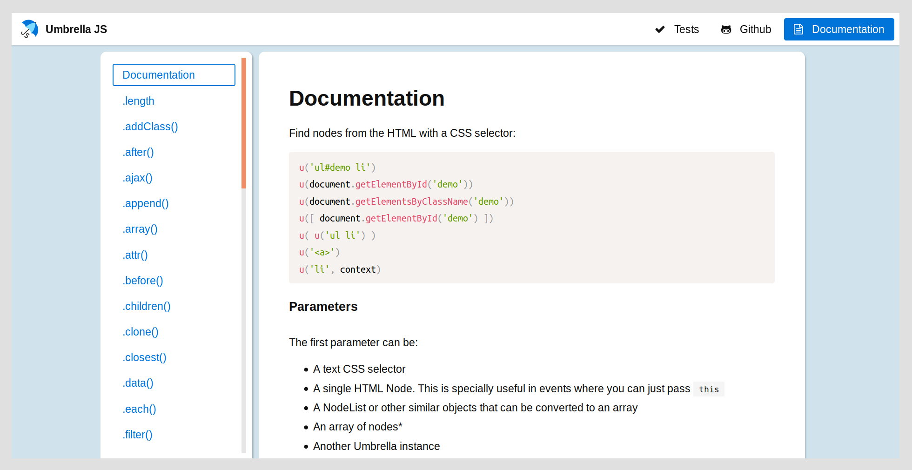

# Paperdocs

A beautiful and highly responsive theme for documentation:

```html
<link href="https://unpkg.com/paperdocs@1/paperdocs.min.css" rel="stylesheet">
<script src="https://unpkg.com/paperdocs@1/paperdocs.min.js"></script>
```

Include the two snippets above for the style and functionality of this page, including:

- Automatic syntax highlighting
- Menu creation for responsive website
- Menu creation on demand (see below)
- Automatic markdown parsing from external file on demand


## Navigation menu

The `<nav>` will automatically render as a drop-down menu on mobile (try it by resizing this window), so your users will have the functionality they want there. This is how it looks **on large screens**:


And this is the mobile version. **When you scroll on mobile the nav shows the current section**:


When clicking on the ☰, the menu drops down showing all available sections and the 2-4 buttons that were on the top-right before on the bottom:


To get this awesome menu, use this html:

```html
<nav class="super">
  <a href="#" class="brand">
    
    <span class="text">Umbrella JS</span>
  </a>

  <input id="bmenu" type="checkbox" class="show">
  <label for="bmenu" class="burger pseudo button switch"></label>

  <header><strong>Umbrella JS</strong></header>
  <div class="menu loading" data-headers="h2">
    <ul class="flex two three-600"></ul>
  </div>

  <footer>
    <div class="flex">
      <a class="pseudo button" href="/tests">
        <i class="fa fa-check"></i> Tests
      </a>
      <a class="pseudo button" href="https://github.com/umbrellajs/umbrella">
        <i class="fa fa-github-alt"></i> Github
      </a>
      <a class="button" href="/documentation">
        <i class="fa fa-file-text-o"></i> Documentation
      </a>
    </div>
  </footer>
</nav>
```

There are a couple of things to note here:

- The `.menu.loading` has an attribute called `data-headers="h2"`. This represents what kind of headings will be parsed and make it into the menu. You can adjust it to `data-headers="h1, h2"`, `data-headers="h2, h3"`, etc as you prefer.
- The bottom menu on mobile will get its width according to their content (with flexbox). To force a specific width, add the corresponding class to the first `<div>` inside `<footer>` [according to Picnic CSS' grid system](picnicss.com/documentation#grids).
- Similarly, you can set the drop-down menu to more than 1 column if there are too many sections as you can see in [Umbrella JS](http://umbrellajs.com/documentation). For this, set the corresponding class [according to Picnic CSS grid system](picnicss.com/documentation#grids) to the `<ul>` inside `.menu`.


## Single column

[**Live demo**](http://francisco.io/paperdocs/single):

[](http://francisco.io/paperdocs/single)

This is the current layout, a single column. The most important element is the `<article>`, to load a page like this do:

```html
<!DOCTYPE html>
<html>
  <head>
    <title>Documentation</title>
    <meta charset="utf-8">

    <!-- other tags here -->

    <link href="https://unpkg.com/paperdocs@1/paperdocs.min.css" rel="stylesheet">
  </head>
  <body>

    <!-- <nav> goes here -->

    <article class="loading" data-src="documentation.md"></article>

    <script src="https://unpkg.com/paperdocs@1/paperdocs.min.js"></script>
  </body>
</html>
```

It will load the content from `documentation.md` (markdown) and then render it as html inside this article and remove the spinner.

You can also load it *server-side* and just put the HTML inside the article, which will be rendered properly. Don't forget to remove all the attributes in that situation:

```html
<body>
  <!-- <nav> goes here -->

  <article>
    <h1>Documentation</h1>
    ...
  </article>

  <!-- include the library's js here -->
</body>
```


## Create a side menu

> Important: you also have to set the class `withaside` to the body:

[See example](http://francisco.io/paperdocs/aside):




```html
<body class="withaside">
  <!-- <nav> goes here -->

  <aside data-headers="h1, h2">
    <ul></ul>
  </aside>

  <article>
    <h1>Documentation</h1>
    ...
  </article>

  <!-- include the library's js here -->
</body>
```


## Import markdown

There are three possible cases for setting the source for the documentation:

### Server-side render

If you are using some templating system such as `pug` (previously `jade`), then the best way is that you parse the markdown straight on the back-end (or on compile-time) so Google and other spiders can see it straight away:

```pug
article
  include:marked ../README.md
```

> To have `:marked` available in pug/jade you'll have to install previously the package `jstransformer-marked`

In this way, the server is sending a pure-html file so everything works well. Te client-side javascript will handle the Tables of Content including the `<nav>` and the syntax highlighting.

### Client-side load

You can specify to load a markdown file this way:

```html
<article class="loading" data-src="README.md"></article>
```

It will load the file `README.md`, parse it into HTML and embed it inside the article. The class `loading` is optional, but it will show a nice spinner while the documentation is loading.


### Client-side render

This has many problems so it's not recommended but might still be useful for some people. Basically, you cannot include any html tag in the markdown in this way or the browser will screw you over by rendering it too soon. But you can do:

```html
<article class="common-mark">
  # Documentation

  This is some cool documentation for my package.
</article>
```
